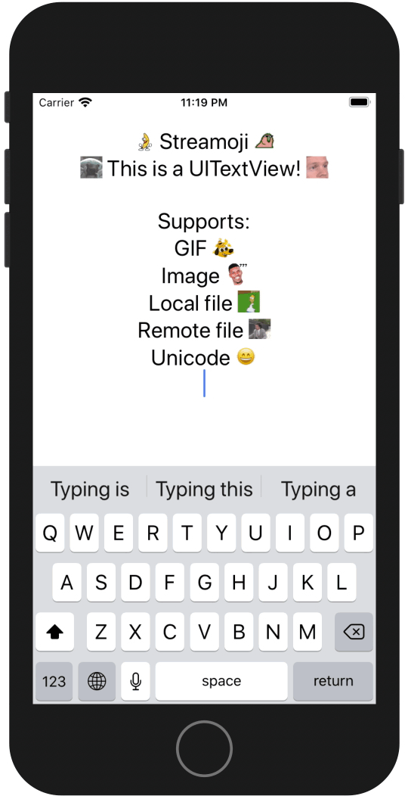

<p align="center">
  <a href="https://github.com/GetStream/Streamoji/"></a>
</p>

<hr />


[](https://twitter.com/intent/tweet?text=Wow:&url=https%3A%2F%2Fgithub.com%2FGetStream%2FStreamoji)




## Usage

### 1. Define Emojis

First step is to define your custom emojis in a dictionary with the key being the :shortcode: for the emoji and the EmojiSource being the, uhmmm, source of the emoji! It can be from GIF or image in a local asset, remote URL, or even a unicode character. You can also define aliases (alternate codes).

```swift
let exampleEmojis: [String: EmojiSource] = [
    "baby_yoda": .imageAsset("baby-yoda-soup.gif"),
    "banana_dance": .imageAsset("bananadance.gif"),
    "excuse_me": .imageAsset("excuseme.gif"),
    "party_parrot": .imageAsset("party_parrot.gif"),
    "this_is_fine": .imageAsset("this-is-fine-fire.gif"),
    "what": .imageAsset("what.png"),
    "homer_disappear": .imageAsset("homer-disappear.gif"),
    "let_me_in": .imageUrl("https://github.com/GetStream/Streamoji/blob/main/meta/emojis/let_me_in.gif?raw=true"),
    "smiley": .character("😄"),
    "heart": .character("❤️"),
    "banana": .alias("banana_dance"),
    "parrot": .alias("party_parrot")
]
```

### 2. Configure UITextView

After defining your emojis, you should call `UITextView.configureEmojis`:

```swift
textView.attributedText = NSAttributedString(string:
    """
    :banana_dance: Streamoji :party_parrot:
    :baby_yoda: This is a UITextView! :excuse_me:

    Supports:
    GIF :this_is_fine:
    Image :what:
    Local file :homer_disappear:
    Remote file :let_me_in:
    Unicode :smiley:
    """
)

textView.configureEmojis(exampleEmojis, rendering: .highestQuality)
```

You can also tweak a couple (for now) rendering options: `quality` and `scale`.

## Example

To run the example project, clone the repo, and run `pod install` from the Example directory first.

## Installation

Streamoji is available through [CocoaPods](https://cocoapods.org). To install
it, simply add the following line to your Podfile:

```ruby
pod 'Streamoji'
```

## Author

cardoso, matheus@gestream.io

## License

Streamoji is available under the MIT license. See the LICENSE file for more info.
